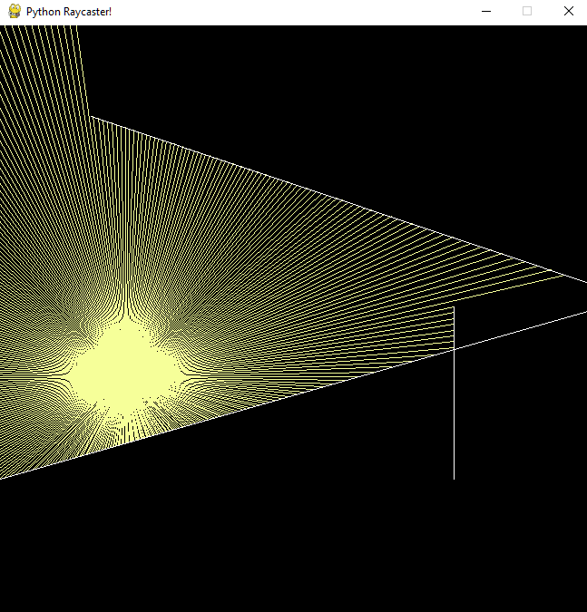
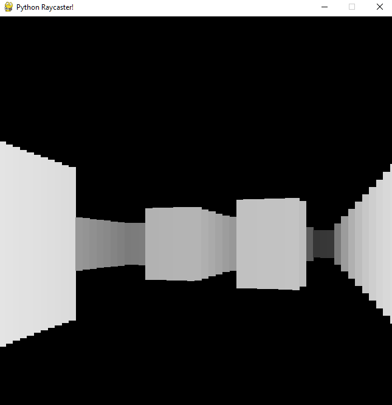

# pyraycaster
Raycaster built with Python.

# How to run

1. Switch to desired branch:

* `git switch main` for 2D Raycaster
* `git switch 3D` for 3D Raycaster

1. Install dependencies:

`pip install -r requirements.txt`

1. Run the project:

`python -m pyraycaster`

# How to play

* W & S or Up Arrow & Down Arrow to move forward and backward
* A & D or Right Arrow & Left Arrow to look around